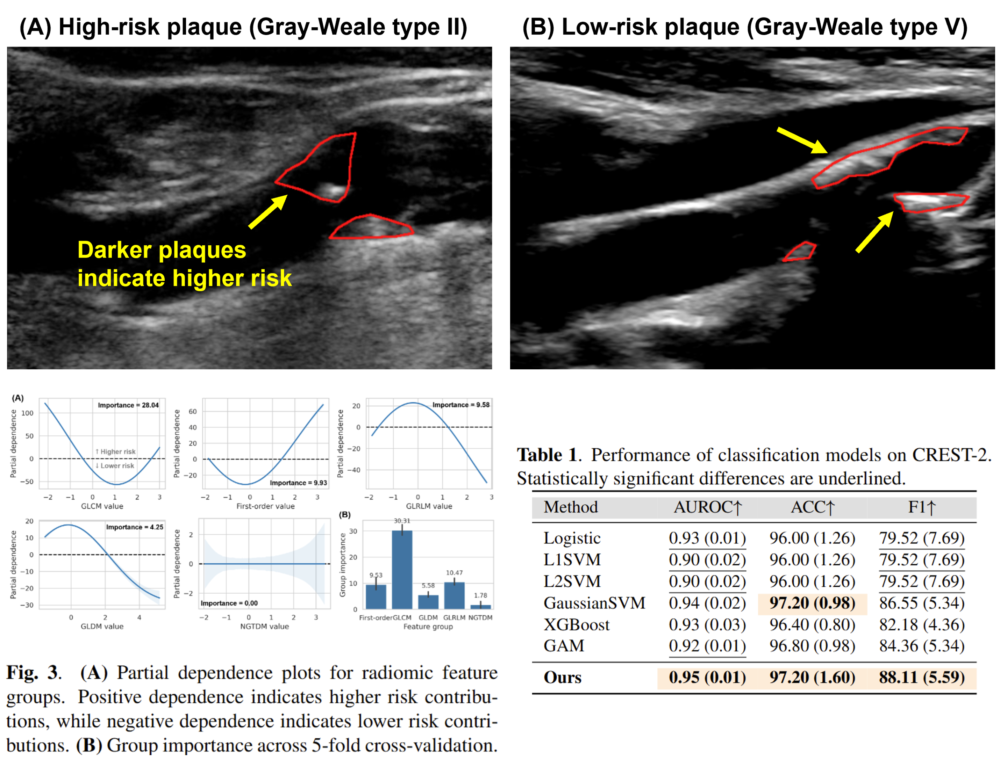

# CRESTomics

> Official repository for the ISBI 2026 paper "CRESTomics: Analyzing Carotid Plaques in the CREST-2 Trial with a New Additive Classification Model".

#### **[[📄Paper](https://arxiv.org/abs/2603.04309)]**

The accurate characterization of carotid plaques is critical for stroke prevention in patients with carotid stenosis. We analyze 500 plaques from the [Carotid Revascularization and Medical Management for Asymptomatic Carotid Stenosis Study (CREST-2)](https://www.crest2trial.org/), a multi-center randomized clinical trial investigating stroke prevention strategies for asymptomatic carotid stenosis, to identify radiomics-based markers from B-mode ultrasound images linked with high-risk. In this work, we propose a new kernel-based classification additive model, combining coherence loss with group-sparse regularization for nonlinear classification. Group-wise additive effects of each feature group are visualized using partial dependence plots. Our results indicate our method accurately and interpretably assesses plaques compared to baselines, revealing a strong association between plaque texture and clinical risk.



## Citation

```
@inproceedings{kulkarni2026crestomics,
    title={CRESTomics: Analyzing Carotid Plaques in the CREST-2 Trial with a New Additive Classification Model},
    author={Kulkarni, Pranav and Lal, Brajesh K. and Jreij, Georges and Vallamchetla, Sai and Green, Langford and Voeks, Jenifer and Huston, John and Edwards, Lloyd and Howard, George and Maron, Bradley and Brott, Thomas and Meschia, James and Doo, Florence X. and Huang, Heng},
    booktitle={IEEE International Symposium on Biomedical Imaging (IEEE ISBI)},
    year={2026},
    month={April},
}
```